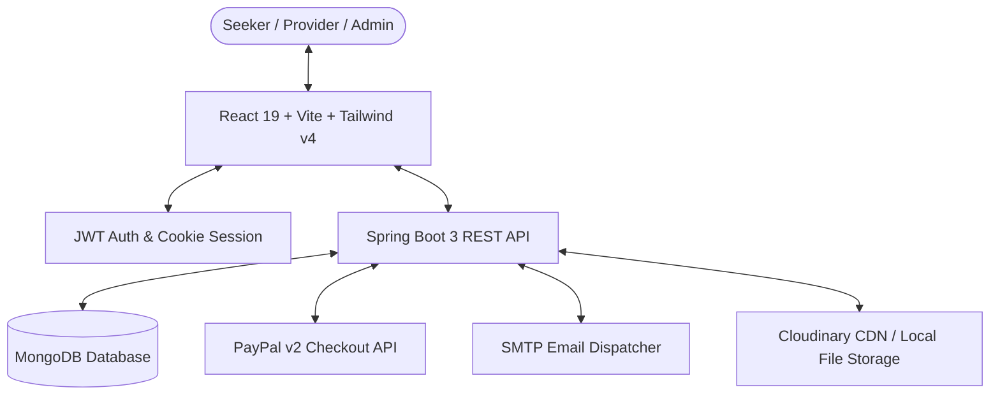

# 🏡 PG Made Eazy — Modern Paying Guest & Accommodation Platform

[](https://react.dev/)
[](https://spring.io/projects/spring-boot)
[](https://www.mongodb.com/)
[](https://tailwindcss.com/)
[](https://developer.paypal.com/)
[](https://www.oracle.com/java/)

**PG Made Eazy** is an end-to-end, full-stack web platform designed to streamline student and working professional accommodation discovery, host listing management, and administrative safety compliance audits. Built with a sleek **Dark Obsidian & Warm Orange** design system, the application delivers zero-brokerage direct connections, verified room photo mosaics, and encrypted PayPal digital escrow checkout.

---

## 📑 Table of Contents
- [✨ Key Features](#-key-features)
- [🏛️ System Architecture](#️-system-architecture)
- [💻 Tech Stack](#-tech-stack)
- [📁 Project Structure](#-project-structure)
- [⚙️ Prerequisites & Installation](#️-prerequisites--installation)
- [🔐 Environment & Configuration](#-environment--configuration)
- [🚀 Running the Application](#-running-the-application)
- [📡 Core API Endpoints](#-core-api-endpoints)
- [🛡️ Security & Escrow Lifecycle](#️-security--escrow-lifecycle)
- [🤝 Contributing & License](#-contributing--license)

---

## ✨ Key Features

### 🔍 1. Seeker Experience (Residents & Students)
- **Smart Discovery Engine:** Instant city, area, price range, room type, rule tags, and amenity filtering.
- **Airbnb-Style Photo Mosaic & Lightbox:** 5-photo grid preview with full-screen zoom lightbox modal.
- **Live Room Availability & Price Calculator:** Real-time room vacancy calculation with instant duration-based pricing in INR and USD.
- **PayPal Digital Escrow Checkout:** Secure online payment processing with automatic receipt generation (`.txt` digital vouchers).
- **Reservation Dashboard:** Centralized booking history tracking with status badges (`PENDING`, `CONFIRMED`, `CANCELLED`).
- **Profile Management:** Student and professional profile data, identity verification status, and emergency contact details.

### 🏠 2. Provider / Host Portal (Property Owners & Managers)
- **Drag-and-Drop Listing Creation:** Multi-photo upload dropzone with thumbnail previews, interactive amenity/house rule pill selectors, and deposit configuration.
- **Property Catalog Management:** Live accommodation inventory with inline editing, deletion, and real-time approval status pills (`APPROVED`, `PENDING`, `REJECTED`).
- **Audit Feedback & Resubmission:** Review specific auditor rejection feedback and resubmit updated listings with a single click.
- **Resident Tenant Directory:** Comprehensive resident occupant cards with stay dates, room allocations, and payment verification chips.
- **Revenue & Escrow Tracking:** Metrics for collected rent, pending escrow balances, and security deposits.

### 🛡️ 3. Superadmin Compliance Engine
- **Audit Approval Queue:** Side-by-side inspection cards with photo carousel, occupancy limits, and host contact proofs.
- **Listing Action Workflow:** Single-click approval or rejection with mandatory feedback reason modal logged directly to the host.
- **Active & Rejected Archives:** Categorized catalogs of all live discoverable properties and rejected listings.
- **Verified Host & Seeker Directories:** Comprehensive user registries with Government ID verification tracking and contact logs.

---

## 🏛️ System Architecture



---

## 💻 Tech Stack

### Frontend
- **Framework:** React 19.0 + Vite 6.1
- **Styling:** Tailwind CSS v4.0 (`@tailwindcss/vite`) + Custom Glassmorphism System
- **Typography:** `Outfit` (Headings) & `Plus Jakarta Sans` (Body text)
- **Icons:** Lucide React (`lucide-react`)
- **Routing:** React Router DOM v7
- **HTTP Client:** Axios with JWT request/response interceptors
- **Notifications:** React Hot Toast (`react-hot-toast`)
- **State & Auth:** React Context API (`AuthContext`) + `js-cookie`

### Backend
- **Framework:** Java 17 + Spring Boot 3.1.0
- **Database:** MongoDB & Spring Data MongoDB
- **Security:** Spring Security + JSON Web Tokens (`jjwt` 0.11.5)
- **Payments:** PayPal Checkout Java SDK (`checkout-sdk` 2.0.0)
- **Email:** Spring Mail + Jakarta Mail + Thymeleaf Templates
- **File Storage:** Multipart File Upload + Cloudinary SDK
- **Utilities:** Project Lombok, Commons IO, Apache HttpClient 5

---

## 📁 Project Structure

```
PGMadeEazy/
├── backend/
│   ├── pom.xml                               # Maven build configuration
│   └── src/
│       ├── main/
│       │   ├── java/com/pgmadeeazy/
│       │   │   ├── config/                   # Security, PayPal & CORS Config
│       │   │   ├── controller/               # REST API Controllers (Auth, Booking, Property, Admin)
│       │   │   ├── model/                    # MongoDB Entity Models (User, Seeker, Provider, Property, Booking)
│       │   │   ├── repository/               # Spring Data Mongo Repositories
│       │   │   ├── security/                 # JWT Authentication Filter & Token Provider
│       │   │   └── service/                  # Business Logic Services
│       │   └── resources/
│       │       ├── application.properties    # Server, Database, Mail & PayPal Properties
│       │       └── templates/                # Email Thymeleaf Templates
│       └── test/                             # Unit & Integration Tests
│
└── frontend/
    ├── index.html                            # HTML entry with Google Fonts
    ├── package.json                          # NPM dependencies & scripts
    ├── vite.config.js                        # Vite + Tailwind v4 plugin config
    └── src/
        ├── components/common/                # Global Header, Footer, ProtectedRoute
        ├── context/                          # AuthContext (Login, Register, Roles)
        ├── features/
        │   ├── admin/components/             # AdminDashboard, PropertyApproval, Catalog, User Directories
        │   ├── auth/components/              # SignIn, Multi-step SignUp (Seeker & Provider)
        │   ├── landing/                      # Modern Hero, Stats, FAQ, Testimonials
        │   ├── provider/components/          # ProviderDashboard, AddProperty, MyProperties, Tenants, Payments
        │   └── seeker/components/            # FindPG, PropertyDetails, BookingForm, MyBookings, PayPalSuccess/Cancel
        ├── pages/                            # HowItWorks, Contact
        ├── routes/AppRoutes.jsx              # Centralized route mapping & protected routes
        ├── services/api.js                   # Axios API services
        └── utils/imageUtils.js               # Resilient Unsplash fallback image handler
```

---

## ⚙️ Prerequisites & Installation

Ensure you have the following installed on your development machine:
- **Node.js:** v18.0 or higher
- **npm:** v9.0 or higher
- **Java JDK:** Version 17 (or 21)
- **Maven:** v3.8+ (or use the embedded `./mvnw`)
- **MongoDB:** Local instance on port `27017` or a MongoDB Atlas connection string

---

## 🔐 Environment & Configuration

### 1. Backend (`backend/src/main/resources/application.properties`)
```properties
# Server Configuration
server.port=8080

# MongoDB Connection
spring.data.mongodb.uri=mongodb://localhost:27017/pgmadeeazy

# JWT Authentication
jwt.secret=your_super_secret_jwt_256_bit_key_here
jwt.expiration=86400000

# PayPal Sandbox Credentials
paypal.client.id=YOUR_PAYPAL_CLIENT_ID
paypal.client.secret=YOUR_PAYPAL_CLIENT_SECRET
paypal.mode=sandbox

# Mail Dispatcher (Optional for notifications)
spring.mail.host=smtp.gmail.com
spring.mail.port=587
spring.mail.username=your_email@gmail.com
spring.mail.password=your_app_password
```

### 2. Frontend (`frontend/.env` or default)
```env
VITE_API_BASE_URL=http://localhost:8080
```

---

## 🚀 Running the Application

### Start Backend (Spring Boot)
```bash
cd backend
mvn clean spring-boot:run
```
*The Spring Boot server will start on `http://localhost:8080`.*

### Start Frontend (Vite + React)
```bash
cd frontend
npm install
npm run dev
```
*The React application will be accessible at `http://localhost:5173`.*

---

## 📡 Core API Endpoints

### 🔑 Authentication (`/api/auth`)
| Method | Endpoint | Description |
| :--- | :--- | :--- |
| `POST` | `/api/auth/register` | Register new Seeker or Provider account |
| `POST` | `/api/auth/login` | Authenticate user & receive JWT token |
| `POST` | `/api/auth/logout` | Invalidate current session |

### 🏠 Properties (`/api/properties`)
| Method | Endpoint | Description |
| :--- | :--- | :--- |
| `GET` | `/api/properties/approved` | Get all verified public accommodation stays |
| `POST` | `/api/properties` | Create new listing with multipart photos |
| `GET` | `/api/properties/owner/email/{email}` | Retrieve listings for a specific provider |
| `POST` | `/api/properties/{id}/approve` | Admin approve property listing |
| `POST` | `/api/properties/{id}/reject` | Admin reject property with feedback note |

### 📅 Bookings & Escrow (`/api/bookings`)
| Method | Endpoint | Description |
| :--- | :--- | :--- |
| `POST` | `/api/bookings` | Create pending reservation hold |
| `GET` | `/api/bookings/available-rooms` | Query live room availability by date range |
| `GET` | `/api/bookings/seeker/{seekerId}` | Get reservation history for a resident |
| `POST` | `/api/bookings/payments/paypal` | Initialize PayPal checkout payment session |
| `GET` | `/api/bookings/payments/paypal/success` | Execute and verify PayPal payment capture |

---

## 🛡️ Security & Escrow Lifecycle

1. **Authentication:** All protected routes require a signed JWT token passed via HTTP Authorization header (`Bearer <token>`).
2. **Role-Based Access Control (RBAC):** Distinct authorization roles (`SEEKER`, `PROVIDER`, `ADMIN`) protect endpoints and dashboard views.
3. **Escrow Guarantee:** Payments are captured via PayPal Sandbox escrow. If a user cancels during checkout, the pending booking is automatically transitioned to `CANCELLED` and room inventory is released.

---

## 🤝 Contributing & License

Contributions, issues, and feature requests are welcome!
- Feel free to submit a pull request or open an issue on GitHub.
- Distributed under the **MIT License**.
